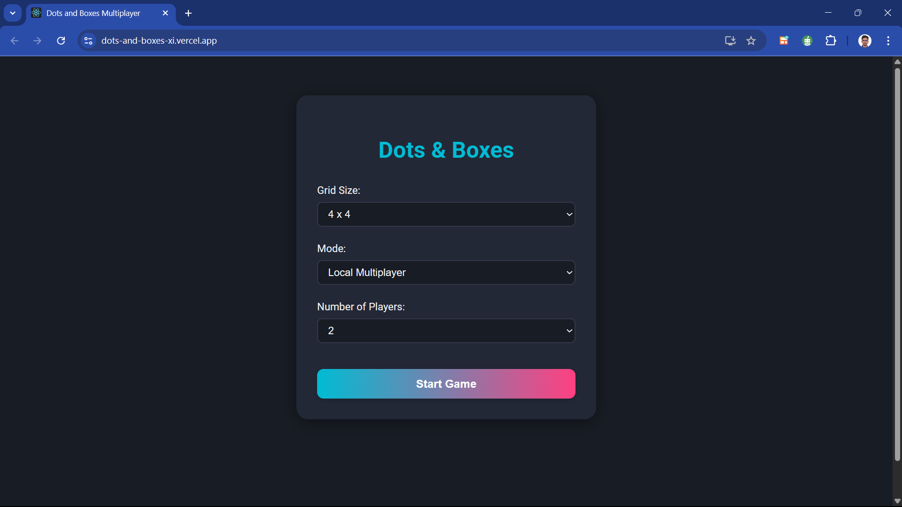
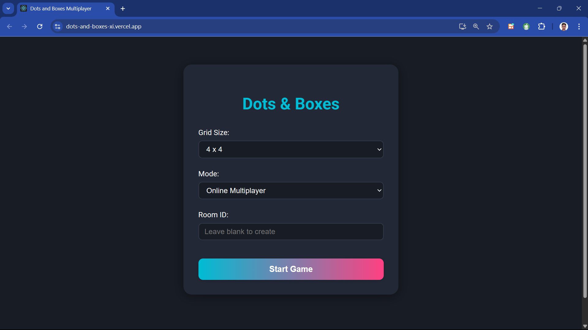
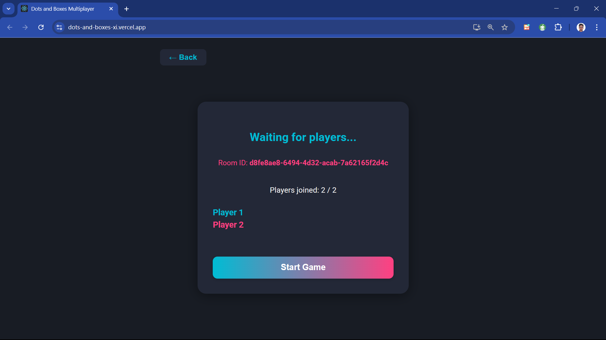
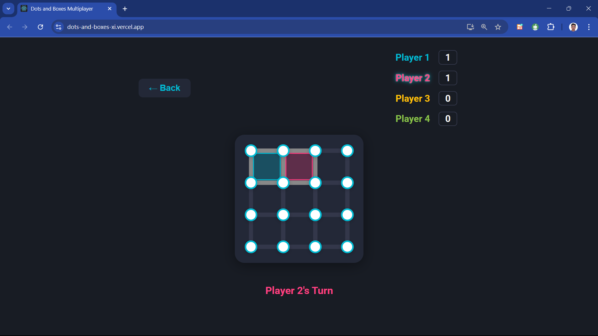

# 🎮 Dots and Boxes Multiplayer

A modern, fully-featured implementation of the classic Dots and Boxes game with both local and online multiplayer capabilities. Built with React and Node.js/Socket.io for real-time multiplayer gaming.

## 🎯 Live Demo

**[Play Now →](https://dots-and-boxes-xi.vercel.app/)**

Challenge your friends in this strategic game where you connect dots to form boxes and claim territory!

## ✨ Features

### 🎲 Game Modes

- **Local Multiplayer**: Play with 2-4 players on the same device
- **Online Multiplayer**: Create or join rooms to play with friends remotely
- **Customizable Grid**: Choose from 3x3 to 10x10 grid sizes for varying difficulty levels

### 🎨 User Experience

- **Dark Mode UI**: Beautiful, eye-friendly dark theme with vibrant player colors
- **Responsive Design**: Seamlessly works on desktop, tablet, and mobile devices
- **Real-time Updates**: Instant game state synchronization across all players
- **Turn-based Logic**: Clear visual indicators showing whose turn it is
- **Anti-cheat Protection**: Server-side validation prevents unauthorized moves

### 🏆 Game Features

- **Smart Scoring System**: Automatic box completion detection and scoring
- **Player Ownership**: Completed boxes are colored with the player's unique color
- **Room System**: Easy-to-use room creation and joining with shareable room IDs
- **Waiting Room**: Players can see who's joined before starting the game
- **Game Over Detection**: Automatic winner determination when all boxes are completed

## 🛠️ Technical Implementation

### Frontend (React)

- **State Management**: Efficient React hooks for game state and socket connections
- **Socket.io Client**: Real-time communication with WebSocket fallback
- **CSS Grid & Flexbox**: Responsive layout with precise game board positioning
- **Environment Configuration**: Seamless development to production deployment

### Backend (Node.js + Socket.io)

- **Real-time Multiplayer**: Socket.io server handling multiple concurrent games
- **Room Management**: Dynamic room creation, joining, and cleanup
- **Game Logic Validation**: Server-side move validation and game state management
- **CORS Configuration**: Secure cross-origin requests for deployed applications

### Key Technical Features

- **Turn Enforcement**: Only the current player can make moves (prevents cheating)
- **Box Completion Algorithm**: Efficient detection of completed squares after each move
- **Connection Management**: Automatic cleanup of disconnected players
- **Scalable Architecture**: Modular design supporting multiple simultaneous games

## 🎪 Game Rules

1. **Objective**: Complete more boxes than your opponents by drawing lines between dots
2. **Gameplay**: Players take turns drawing horizontal or vertical lines between adjacent dots
3. **Scoring**: When a player completes the fourth side of a box, they score a point and get another turn
4. **Winning**: The player with the most completed boxes when all possible lines are drawn wins

## 🏗️ Architecture

```
Frontend (React + Socket.io Client)
├── Game Board Rendering
├── User Input Handling
├── Real-time State Updates
└── Room Management UI

Backend (Node.js + Socket.io Server)
├── WebSocket Connection Management
├── Game State Validation
├── Room Creation & Joining
└── Move Broadcasting
```

## 📱 Screenshots






## 🚀 Deployment

- **Frontend**: Deployed on [Vercel](https://dots-and-boxes-xi.vercel.app/)
- **Backend**: Deployed on [Render](https://dots-and-boxes-yxd9.onrender.com)
- **Real-time Communication**: WebSocket connections with polling fallback

---

Built with ❤️ by Dipesh Goel
